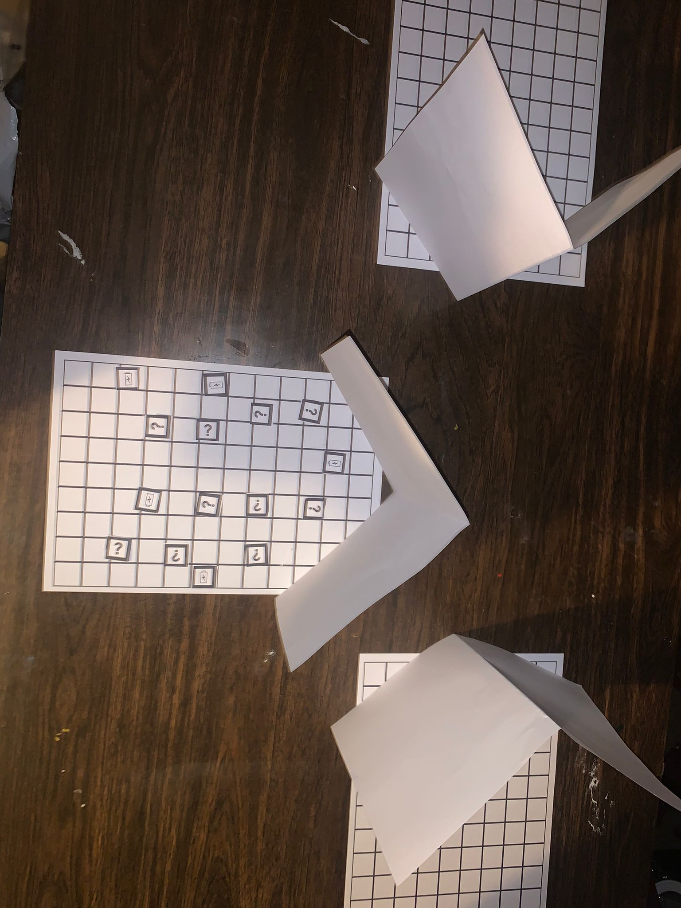

# Dark Pictures

## Doel van de Speler – De Fotograaf
- Verzamel alle clue-kaartjes (met vraagteken-icoon).
- Gebruik de camera-flash om de Entity tijdelijk te verdoven wanneer deze te dichtbij komt.
- Nadat alle clues verzameld zijn, moet de speler ontsnappen via zijn eigen startpositie.

---

## Spelverloop
- De speler beweegt over het bord door een dobbelsteen te rollen.
- De AI Entity (spelbegeleider) rolt eveneens een dobbelsteen en probeert de speler te onderscheppen.
- Wanneer de speler op een clue-vakje landt, mag hij het bijbehorende kaartje van het bord nemen.
- De AI Entity probeert actief de speler te bereiken en te vangen.

---

## Camera-flash & Batterijsysteem

### Overzicht
| Onderdeel | Beschrijving |
|-----------|--------------|
| Flashgebruik | De speler kan de flash maximaal 3 keer gebruiken. |
| Batterij-iconen | Liggen verspreid op het bord. |
| Batterij opladen | Bij het betreden van een batterij-icoon wordt de batterij volledig opgeladen (opnieuw 3 flashes). |

### Extra regels
- Het batterij-kaartje wordt verwijderd wanneer de speler erop landt.
- Wordt de speler bereikt door de Entity terwijl hij geen flash meer heeft, dan wordt hij gepakt.

---

## Startposities
- De speler start aan één kant van het bord.
- De AI Entity start recht tegenover de speler, aan de andere kant van het bord.

---

## Einde van het Spel
- **De speler wint** wanneer alle clues verzameld zijn en hij via zijn startpunt weet te ontsnappen.
- **De AI Entity wint** wanneer de speler wordt gepakt terwijl hij geen beschikbare flash meer heeft.

---

## Mechanics die we proberen testen
- Lopen doorheen donkere ruimtes.
- Camera flist gebruiken tegen de entity.
- De batterij van de camera laden.

---

# Foto's
Map:

